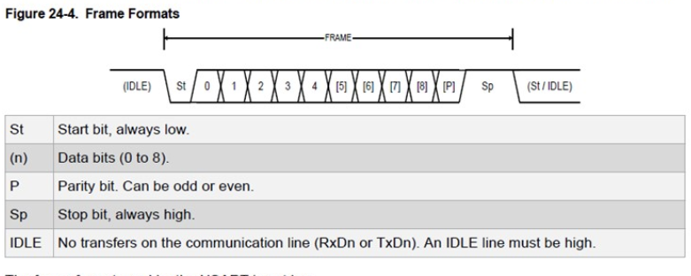
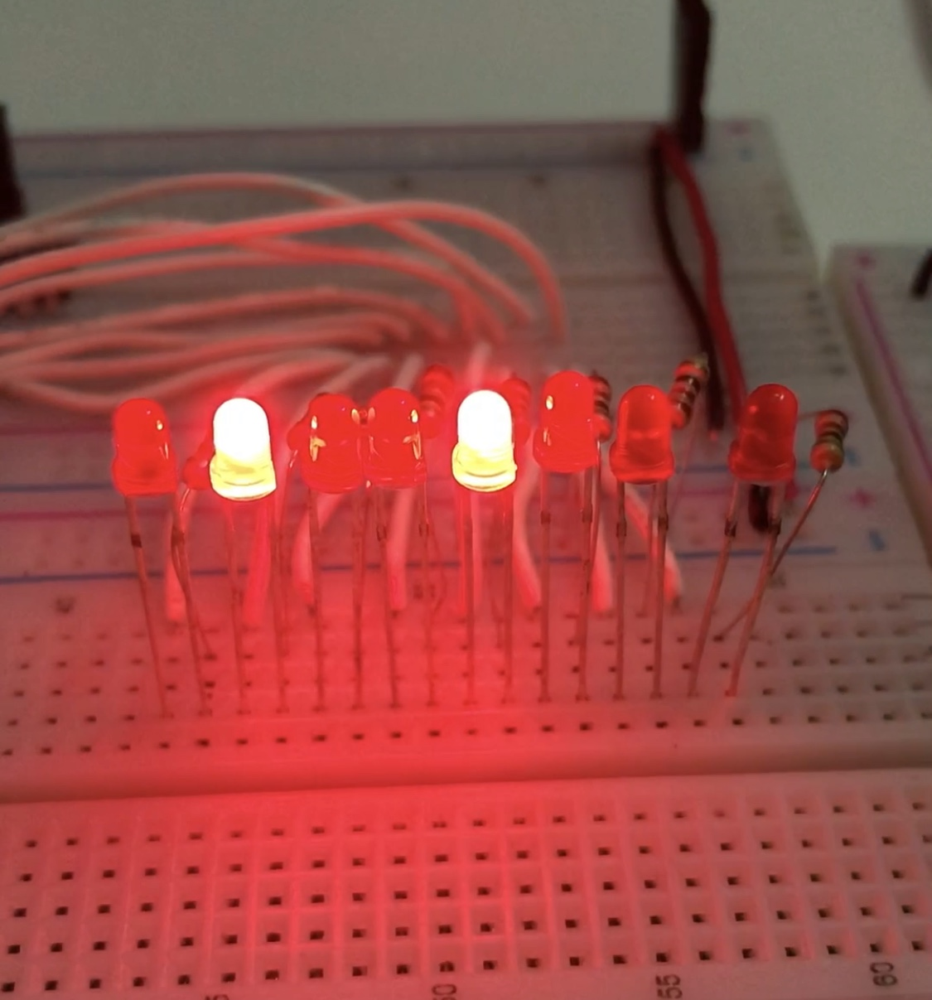
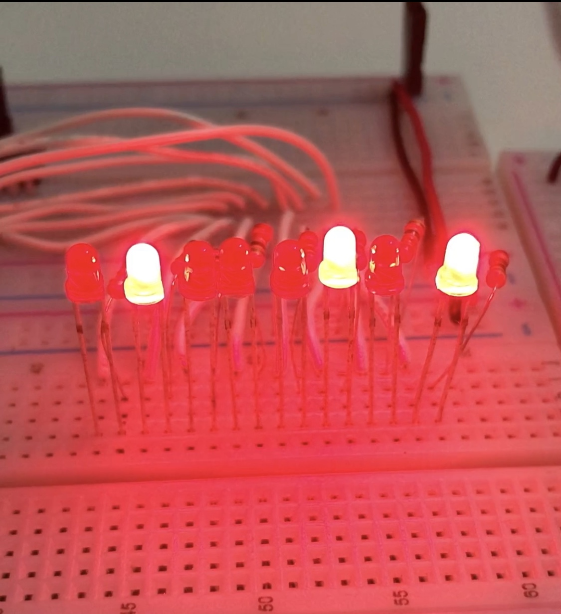
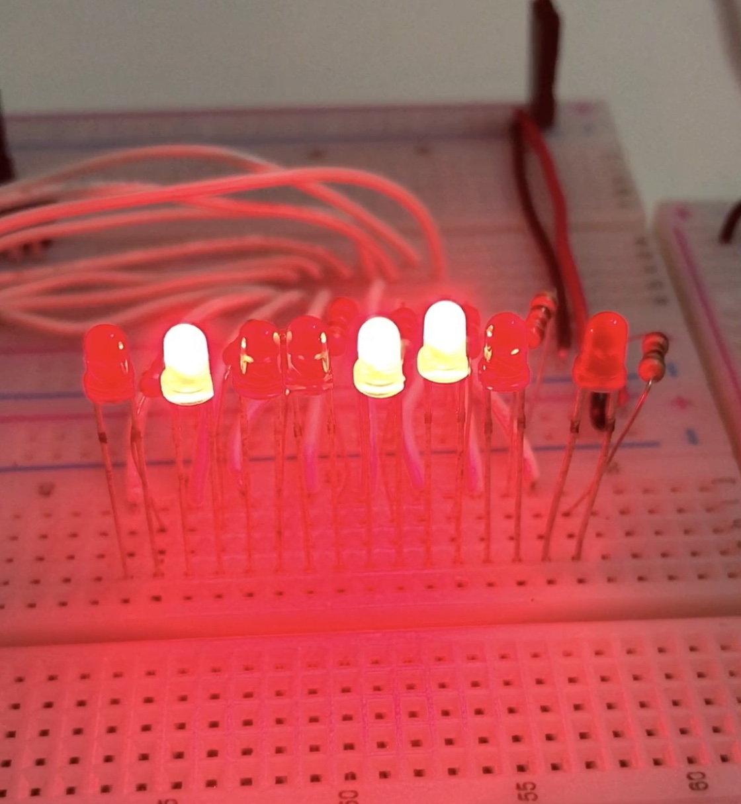
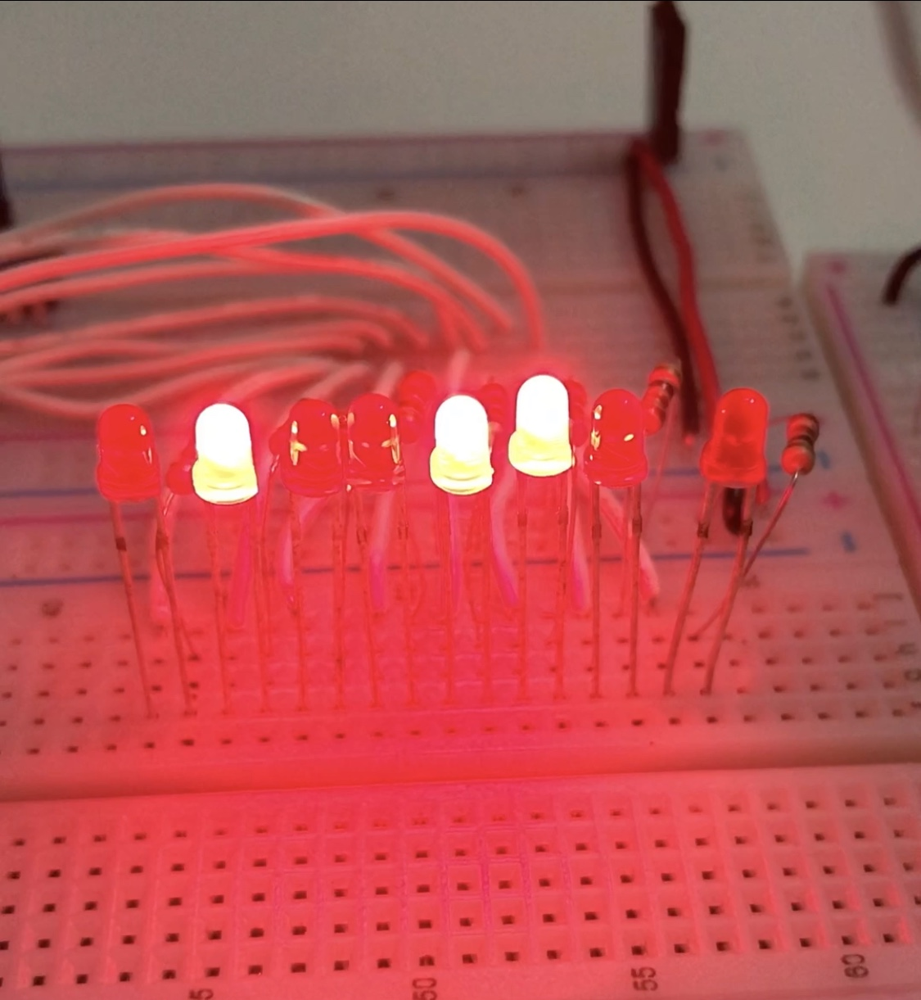
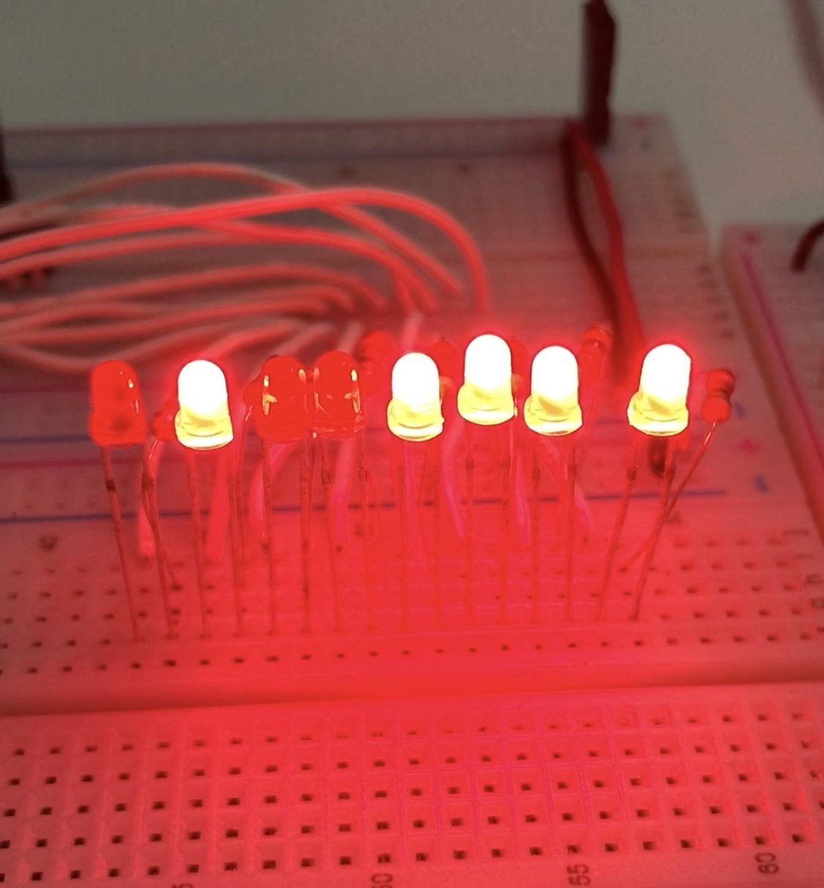

# Data Transmission
## Ryan Kane and Isaiah Plummer

Data transmission program for the ATmega328P microcontroller, including a transmitter and reciever. The program is uploaded using a microchip SNAP In-circuit Debugger/Programmer, and the code is written in the MPLAB X IDE. The ATmega328P is connected using SPI mode, and the pin connections to the SNAP are as follows:

SNAP | ATmega328P
-------- | ---------
VTG (pin 2) | VCC (pin 7)
GND (pin 3) | GND (pin 8)
MISO (pin 4) | PB4 (pin 18)
SCK (pin 5) | PB5 (pin 19)
NRESET (pin 6) | PC6 (pin 1)
MOSI (pin 7) | PB3 (pin 17)

In the code, the constant TRANSMIT is used to set the ATmegs328P as the transmitter or receiver. One ATmega is used as the transmitter, and one as the receiver. The data framing is show as below, using 2 stop bits and no parity bit as of right now.

[Helpful article and image source](https://forum.arduino.cc/index.php?topic=479134.0)

The message sent by the transmitter is "Hello". When this is read by the receiver, this should be this sequence of LEDS if connected to PORTD (left is most significant bit):

