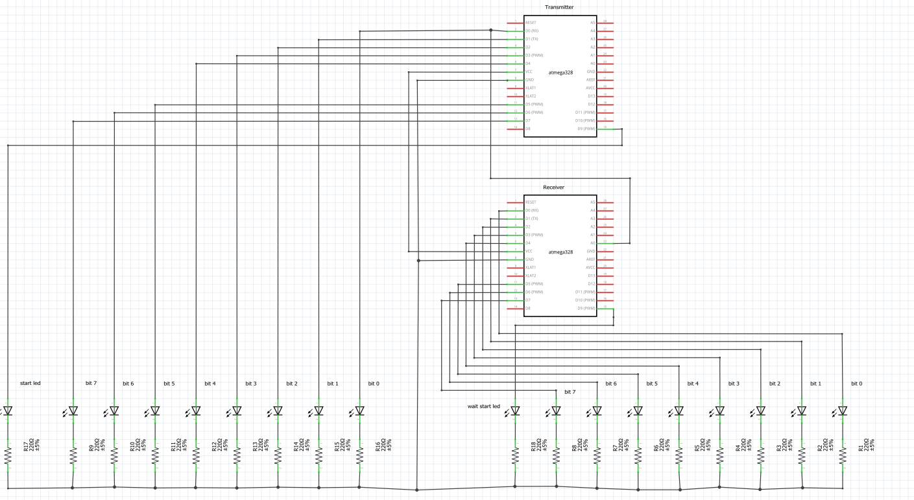

# Data Transmission
## Author: Ryan Kane

Data transmission program for the ATmega328P microcontroller, including a transmitter and receiver. The program is uploaded using a microchip SNAP In-circuit Debugger/Programmer, and the code is written in the MPLAB X IDE. The ATmega328P is connected using SPI mode, and the pin connections to the SNAP are as follows:

### Project Structure
. 
|---- assets&nbsp;&nbsp;&nbsp;&nbsp;&nbsp;&nbsp;&nbsp;&nbsp;&nbsp;&nbsp;&nbsp;&nbsp;&nbsp;&nbsp;# README assets  
|---- header.h&nbsp;&nbsp;&nbsp;&nbsp;&nbsp;&nbsp;&nbsp;&nbsp;&nbsp;&nbsp;# Header file 
|---- main.c &nbsp;&nbsp;&nbsp;&nbsp;&nbsp;&nbsp;&nbsp;&nbsp;&nbsp;&nbsp;&nbsp;&nbsp;&nbsp;# Main driver program  
|---- transmitter.c &nbsp;&nbsp;&nbsp;# Transmitter program 
|---- receiver.c &nbsp;&nbsp;&nbsp;&nbsp;&nbsp;&nbsp;&nbsp;&nbsp;# Receiver program 
|---- README &nbsp;&nbsp;&nbsp;&nbsp;&nbsp;&nbsp;&nbsp;&nbsp;&nbsp;# README 
|---- LICENSE &nbsp;&nbsp;&nbsp;&nbsp;&nbsp;&nbsp;&nbsp;&nbsp;&nbsp;&nbsp;# LICENSE 

### Circuit Diagram
The pin labels correspond to the Arduino pins, but are in the same location.
Refer to the [ATmega328P Datasheet](http://ww1.microchip.com/downloads/en/DeviceDoc/ATmega48A-PA-88A-PA-168A-PA-328-P-DS-DS40002061A.pdf) for the pinout

### SNAP to ATmega328P pin out

SNAP | ATmega328P
-------- | ---------
VTG (pin 2) | VCC (pin 7)
GND (pin 3) | GND (pin 8)
MISO (pin 4) | PB4 (pin 18)
SCK (pin 5) | PB5 (pin 19)
NRESET (pin 6) | PC6 (pin 1)
MOSI (pin 7) | PB3 (pin 17)

### Communication protocol

In the code, the constant TRANSMIT is used to set the ATmegs328P as the transmitter or receiver. One ATmega is used as the transmitter, and one as the receiver. The data framing is show as below, using 2 stop bits, no parity bit, and sends the most significant bit first:

[Helpful article and image source](https://forum.arduino.cc/index.php?topic=479134.0)

The message sent by the transmitter is "Hello". When this is read by the receiver, this should be this sequence of LEDS if connected to PORTD (left is most significant bit):
#### 'H': 01001000

#### 'E': 01000101

#### 'L': 01001100

#### 'L': 01001100

#### 'O': 01001111

